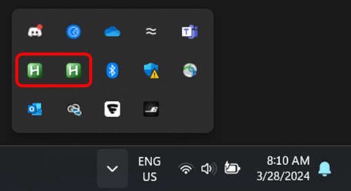

# LEO: Auto-typing Tool for Teaching Coding

**LEO** is a teaching assistant for windows that auto-types code from a lesson plan.

To best understand how it works, please check the [Video Tutorial](https://youtu.be/hHYjqfI19r0) and read the [Paper](https://dl.acm.org/doi/10.1145/3769994.3770055).

### 📦 Installation
Quickest way to get LEO running is using the stable release.

Alternatively, you can install the dependencies **in order**:
1. [Python 3.12.2](https://www.python.org/downloads/release/python-3122)
2. [AutoHotkey v1.1.37.02](https://www.autohotkey.com)
3. [`python_ahk` – A Python wrapper for AutoHotkey](https://pypi.org/project/ahk)

### 🔧 VS Code Setup (Optional)
If you don't have a preferred code editor, I recommend [VS Code](https://code.visualstudio.com)
It comes with advanced features that help experienced coders. These (may) interfere with LEO lesson plans.
You can disable them by loading the VS Code settings provided in the settings folder.

**How to Apply Settings**:
1. Open VS Code.
2. Press `Ctrl + Shift + P`.
3. Search for **"Open User Settings (JSON)"**.
4. Paste the contents of the desired JSON file into the settings and save.

---

## 📂 How to Use

1. **Run the tool**:
   ```bash
   start.bat
   ```

2. **Load a Lesson**:
   - In the interface, go to `Load`.
   - Select `Demo.json` from the `plans/` directory.

3. **Auto-Typing Mode**:
   - Press any **lowercase letter key (a–z)** to advance the typing.
   - Other keys will behave normally.
   - Use `Ctrl + Click` to jump to different parts in the plan.
   - Use `Ctrl + P` to toggle pause.

4. **Create Lesson Plans**:
   - Add auto-typing or comment fields.
   - Remove selected fields.
   - Apply some auto-formatting.
   - Use special functions: save, backspace, arrow keys, etc.

<p align="left">
  
</p>

**Tutorial Video**: To Appear...

---

## 📝 Notes

- 🪟 **Windows only**.
- 💻 Most of the code is written in Python.
- ⚙️ Requires some understanding of AutoHotkey (AHK).
- ❗Current version of AHK (v1.1.37.02) is now deprecated (still works at the moment)
- To create a new installation binary, use [InnoSetup](https://jrsoftware.org/isinfo.php). Open LEOinstaller.iss, press compile on the toolbar, and it will create an exe file in the Output folder.
- `screen.ahk` provides optional window management shortcuts:
  - `Ctrl + Shift + Space`: Keep window on top.
  - `Ctrl + Shift + T`: Toggle window transparency.
- `kill.bat` stops all AHK scripts (check system tray for active ones).
<p align="left">
  
</p>

---

## 📺 Demo
The Demo lesson plan (in the plans folder), was used to create this [video tutorial](https://youtu.be/mwXRhFOxuSQ).

---

## 🧩 Potential Improvements

- Add support for multiple IDEs or settings profiles.
- Option to customize auto-typing trigger keys.
- Improve the interface for broader usability.
- Upgrade to use AHK v2.0

---

## 💡 Contributing

Pull requests are welcome. For major changes, please open an issue first to discuss your idea.

---

## 📜 License

[MIT](LICENSE)
